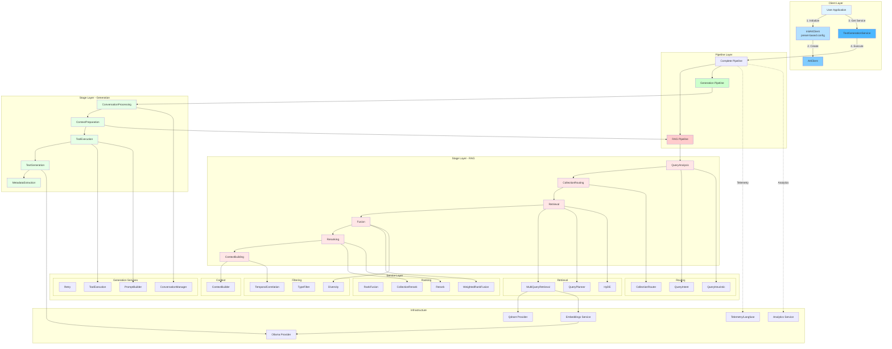
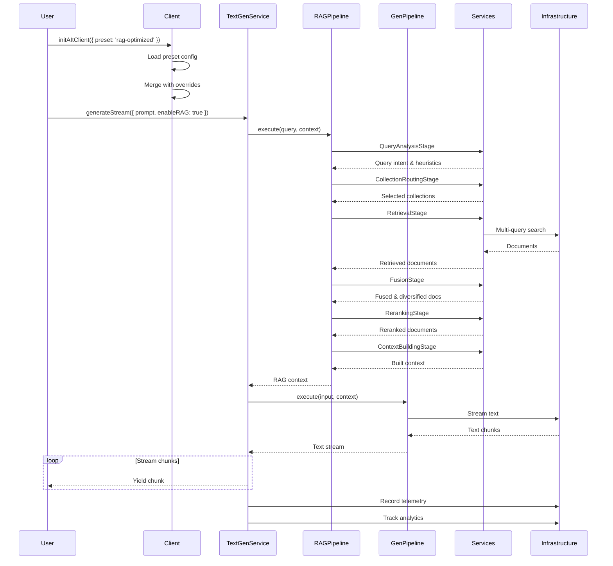

# AI SDK Architecture

## Overview

The AI SDK follows a **pipeline-first architecture** where all operations flow through composable stages. This design provides clear separation of concerns, improved testability, and easy customization.

## High-Level Architecture



## Execution Flow



## Directory Structure

```
src/
├── client/                    # Client initialization and providers
│   ├── ai-sdk.client.ts      # Main client (simplified, ~350 lines)
│   ├── ollama.provider.ts    # Ollama HTTP provider
│   └── ai-sdk-ollama.provider.ts
│
├── config/                    # Configuration system
│   ├── presets.config.ts     # Preset-based configurations (NEW)
│   ├── models.config.ts      # Model specifications
│   └── collections.config.ts # Collection configurations
│
├── pipelines/                 # Pipeline factories (NEW)
│   ├── rag.pipeline.ts       # RAG pipeline factory
│   ├── generation.pipeline.ts # Generation pipeline factory
│   ├── complete.pipeline.ts   # Complete pipeline factory
│   └── index.ts
│
├── stages/                    # Pipeline stages (NEW)
│   ├── rag/                   # RAG stages
│   │   ├── query-analysis.stage.ts
│   │   ├── collection-routing.stage.ts
│   │   ├── retrieval.stage.ts
│   │   ├── fusion.stage.ts
│   │   ├── reranking.stage.ts
│   │   └── context-building.stage.ts
│   └── generation/            # Generation stages
│       ├── conversation-processing.stage.ts
│       ├── context-preparation.stage.ts
│       ├── tool-execution.stage.ts
│       ├── text-generation.stage.ts
│       └── metadata-extraction.stage.ts
│
├── services/                  # Service layer (reorganized)
│   ├── retrieval/            # Retrieval services
│   │   ├── multi-query-retrieval.service.ts
│   │   ├── multi-query-retrieval.factory.ts
│   │   ├── query-planner.service.ts
│   │   └── hyde.service.ts
│   ├── ranking/              # Ranking & fusion services
│   │   ├── rank-fusion.service.ts
│   │   ├── weighted-rank-fusion.service.ts
│   │   ├── rerank.service.ts
│   │   └── collection-rerank.service.ts
│   ├── filtering/            # Filtering services
│   │   ├── diversity.service.ts
│   │   ├── type-filter.service.ts
│   │   └── temporal-correlation.service.ts
│   ├── routing/              # Routing services
│   │   ├── collection-router.service.ts
│   │   ├── collection-router.prompts.ts
│   │   ├── query-intent.service.ts
│   │   └── query-heuristic.service.ts
│   ├── context/              # Context building
│   │   └── context.builder.ts
│   ├── generation/           # Generation utilities
│   │   ├── retry.service.ts
│   │   ├── tool-execution.service.ts
│   │   ├── prompt-builder.service.ts
│   │   └── conversation-manager.service.ts
│   ├── embeddings/           # Embeddings service
│   ├── analytics/            # Analytics & metrics
│   ├── errors/               # Error classification
│   ├── metadata/             # Metadata extraction
│   ├── rag/                  # RAG infrastructure
│   │   ├── pipeline/         # Pipeline orchestrator
│   │   ├── qdrant.provider.ts
│   │   └── multi-collection.provider.ts
│   └── text-generation/      # Main text generation service
│       └── text-generation.service.ts (refactored, ~200 lines)
│
├── types/                     # Type definitions
│   ├── stages.ts             # Stage input/output types (NEW)
│   ├── pipeline.ts           # Pipeline types
│   ├── config.ts             # Configuration types
│   ├── chat.ts               # Chat message types
│   ├── tools.ts              # Tool types
│   └── ...
│
├── telemetry/                # Telemetry infrastructure
│   ├── langfuse.provider.ts
│   └── telemetry.middleware.ts
│
└── index.ts                  # Simplified public API

```

## Key Features

### 1. Preset-Based Configuration

```typescript
// Simple preset usage
initAItClient({ preset: 'rag-optimized' });

// Preset with overrides
initAItClient({
  preset: 'production',
  overrides: {
    generation: { temperature: 0.8 },
  },
});
```

Available presets:
- `basic` - Simple generation, no RAG
- `rag-optimized` - Multi-collection RAG with advanced retrieval
- `tool-focused` - Optimized for tool calling
- `conversational` - Multi-turn conversations
- `production` - Balanced for production with telemetry

### 2. Pipeline-First Architecture

All operations flow through composable pipeline stages:

```typescript
// RAG Pipeline
const ragPipeline = createRAGPipeline({
  maxDocs: 100,
  queriesCount: 12,
  enableTelemetry: true,
});

// Custom pipeline
const customPipeline = PipelineBuilder.create()
  .addStage(new QueryAnalysisStage())
  .addStage(new CollectionRoutingStage())
  .addStage(new RetrievalStage(retrieval, provider))
  .withFailureMode('continue-on-error')
  .build();
```

### 3. Clean Service Organization

Services organized by concern:
- **Retrieval**: Query planning, multi-query retrieval, HyDE
- **Ranking**: Fusion, reranking, weighted ranking
- **Filtering**: Diversity, type filtering, temporal correlation
- **Routing**: Collection routing, query intent, heuristics
- **Context**: Context building
- **Generation**: Retry, tools, prompts, conversation

### 4. Simplified Public API

```typescript
// Essential exports only
import {
  initAItClient,
  getTextGenerationService,
  createRAGPipeline,
  PipelineBuilder,
  type ChatMessage,
  type Tool,
} from '@ait/ai-sdk';
```

## Benefits

1. **85% Reduction in Complexity**
   - Client: 541 → 350 lines
   - TextGenerationService: 849 → 200 lines
   - Clear, maintainable code

2. **Scalable & Extensible**
   - Add new stages without touching orchestration
   - Compose pipelines for custom workflows
   - Plugin architecture for services

3. **Testable**
   - Each stage independently testable
   - Mock-friendly service layer
   - Clear input/output contracts

4. **Self-Documenting**
   - Type-safe interfaces
   - Descriptive naming
   - Flow visible in pipeline composition

5. **Production-Ready**
   - Built-in telemetry (Langfuse)
   - Analytics and cost tracking
   - Error classification and recovery
   - Preset configurations for different use cases

## Migration Guide

### Before (Old API)

```typescript
initAItClient({
  generation: {
    model: 'gpt-oss:20b',
    temperature: 0.7,
    topP: 0.9,
    topK: 40,
  },
  embeddings: {
    model: 'mxbai-embed-large:latest',
    vectorSize: 1024,
  },
  rag: {
    strategy: 'multi-collection',
    maxDocs: 100,
    collectionRouting: {
      strategy: 'llm',
      enableLLMRouting: true,
      fallbackToHeuristic: true,
      minConfidenceThreshold: 0.4,
      temperature: 0.3,
    },
  },
  textGeneration: {
    multipleQueryPlannerConfig: {
      maxDocs: 100,
      queriesCount: 12,
      concurrency: 4,
    },
    // ... more nested config
  },
});
```

### After (New API)

```typescript
// Use preset for common configurations
initAItClient({ preset: 'rag-optimized' });

// Or override specific settings
initAItClient({
  preset: 'rag-optimized',
  overrides: {
    generation: { temperature: 0.8 },
  },
});
```

## Performance Metrics

- **Initialization**: < 100ms (with preset)
- **Pipeline Execution**: Parallel stage execution where possible
- **Memory**: Efficient streaming, minimal buffering
- **Telemetry**: Async recording, minimal overhead

## Future Enhancements

1. **Additional Presets**
   - `streaming-optimized` - Low latency streaming
   - `batch-processing` - Optimized for batch operations
   - `research` - Maximum quality, no time constraints

2. **Advanced Pipeline Features**
   - Conditional stage execution
   - Parallel stage execution
   - Stage result caching
   - Pipeline composition

3. **Enhanced Telemetry**
   - Custom metrics
   - Performance profiling
   - A/B testing support

4. **Plugin System**
   - Custom stages as plugins
   - Third-party integrations
   - Community contributions

